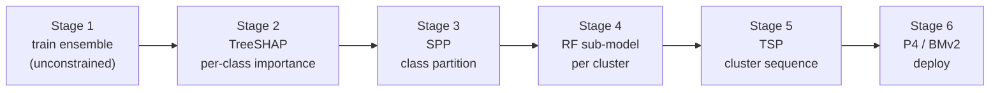

# dune-arena


> The version of [DUNE](https://github.com/nds-group/DUNE) (IEEE INFOCOM 2025) I used to produce
> the results in my undergraduate thesis (TCC), with a handful of tweaks to the pipeline I believe
> improve on the original — chiefly, making the Stage-1 model's choice actually reach the deployed
> switch.

**In-network machine learning** runs a traffic classifier *inside* a programmable switch, at line
rate. **DUNE** makes a model too big for one switch fit by splitting it into hardware-sized
sub-models spread across the switches a flow already crosses. This fork asks one question: *does
the choice of tree ensemble — Random Forest vs the boosting families — actually matter once it is
deployed?* Across ten seeds the short answer is **they tie statistically**. Getting a trustworthy
answer, though, meant fixing a spot where released DUNE silently discards the Stage-1 model's
feature preferences, so the choice never reached hardware. That fix, and the fair
[TreeSHAP](https://github.com/shap/shap) comparison it enables, are what this repo adds.

If you read the thesis and want to run it yourself, jump to [Quickstart](#quickstart-reproduce-a-run).

## Contents

- [How it works](#how-it-works)
- [What I changed vs DUNE](#what-i-changed-vs-dune)
- [Quickstart: reproduce a run](#quickstart-reproduce-a-run)
- [From scratch (raw TON-IoT)](#from-scratch-raw-ton-iot)
- [Stage 6: in-network deploy](#stage-6-in-network-deploy-lab-only)
- [Results](#results)
- [Repository layout](#repository-layout)
- [Caveats](#caveats)
- [Citing](#citing)

## How it works

DUNE's control pipeline runs six stages off-switch and ends in a P4 program per switch:



Stage 1 trains a large model free of hardware limits; Stage 2 scores how much each feature matters
per class; Stage 3 groups classes that share predictors into clusters; Stage 4 trains a
hardware-sized Random-Forest sub-model for each cluster; Stage 5 orders the clusters along the
flow's path; Stage 6 compiles each sub-model to P4. Only Stage 1's *analysis* picks the model — the
sub-models that run on the switch are always Random Forests. **Stages 2 and 4 are where this fork
diverges from DUNE.**

## What I changed vs DUNE

This is a **fork, not a rewrite.** DUNE's six-stage architecture and most of its
pipeline do the heavy lifting — feature extraction (Stage 0), the SPP class
partitioning (Stage 3, untouched), the hardware-aware sub-model training and TCAM
analysis (Stage 4), and the sequencing scaffold (Stage 5) run largely as the authors
wrote them, the bulk of the live pipeline code. My changes are focused:

- **TreeSHAP instead of PCFI (Stage 2).** DUNE scores importance with PCFI, which is tied to one
  model family. TreeSHAP is model-agnostic, so four ensembles compete on equal footing as the
  Stage-1 model: Random Forest, XGBoost, LightGBM, CatBoost.
- **The propagation fix.** Released DUNE's Stage 4 re-derives each
  cluster's features from a *fresh* Random Forest's Gini importance, discarding the Stage-2 scores.
  So the Stage-1 model reached hardware only through the class partition; its feature preferences
  barely propagated. Here, Stage 4 ranks each cluster's features by *that cluster's* TreeSHAP
  importance (restricted to the BMv2-deployable features), so the Stage-1 choice flows all the way
  to the deployed sub-models. See `cluster_analysis/src/model_analysis/modelAnalyzer.py`.
- **Smaller fixes I would keep:** per-class normalization of the TreeSHAP matrix (matches the
  contract DUNE's SPP gain threshold assumes); a flow-grouped train/validation split so no flow
  leaks across it; a brute-force TSP for Stage 5 that drops the Gurobi dependency; a BMv2 P4
  generator with generalized n-class majority voting; and one documented `prepare_dataset.py` in
  place of three data-prep scripts.

## Quickstart: reproduce a run

**Prerequisites:** Python ≥ 3.10 and [uv](https://docs.astral.sh/uv/). (Rebuilding features from raw
pcaps also needs `tshark`, but the prepared dataset below lets you skip that.)

```bash
git clone https://github.com/pedrosuffert/dune-arena && cd dune-arena
uv sync                                    # build the environment from uv.lock

# grab the prepared 7-class dataset (skips all raw-pcap processing)
mkdir -p data
curl -L https://github.com/pedrosuffert/dune-arena/releases/download/v0.1.0/dune-arena-toniot-dataset.tar.gz \
  | tar xz -C data

# run the offline pipeline and print the comparison table
uv run python treeshap/train_models.py     # Stage 1: train the 4 ensembles + TreeSHAP
uv run python treeshap/build_importance.py  # Stage 2: per-class TreeSHAP matrices
uv run python treeshap/run_spp.py           # Stage 3: SPP class partition
uv run python treeshap/stage45.py           # Stage 4 + 5: sub-models, then sequence
uv run python treeshap/collate.py           # -> data/output/results_comparison.csv
```

That reproduces **one seed**. The thesis reports mean ± std over ten; the committed campaign
driver loops seeds, records both Stage-4 regimes offline, and (on a lab box) runs the in-network
deploy per model. The dataset is fixed — `DUNE_SEED` only reseeds model training and the
train/validation split:

```bash
uv run python treeshap/multiseed.py            # 10 seeds; MS_MODELS / MS_PPS to narrow
uv run python treeshap/analyze_multiseed.py    # mean±std, Wilcoxon+Holm, fidelity, partitions
uv run python treeshap/stage1_extract.py       # Stage-1 val table + per-seed TreeSHAP snapshots
uv run python treeshap/make_figures.py         # thesis figures (PDF) from the campaign CSVs
```

## From scratch (raw TON-IoT)

To rebuild the dataset from the original captures instead of the Release:

1. Get the TON-IoT raw pcaps and the `GroundTruth_Network` CSVs (Alsaedi et al., 2020).
2. Point the pipeline at them: env `DUNE_FAIR_RAW` (raw pcap root), `DUNE_FAIR_GT` (ground-truth
   CSVs), and optionally `DUNE_FAIR_DATA` (work/output root, default `<repo>/data`).
3. Carve per-class pcaps, extract features with DUNE's Stage 0 (needs `tshark`), build the dataset:

```bash
uv run python treeshap/build_label_map.py    # Flow ID -> Label, from the GroundTruth CSVs
uv run python treeshap/carve_slim_pcaps.py   # GT-filtered attack-only pcaps + clean benign 'normal'
# DUNE Stage 0, once per pcap dir (edit data_generation/src/params.ini data_path):
#   data/slim_pcaps, then data/dos_only
uv run python data_generation/src/generate_data.py
uv run python treeshap/prepare_dataset.py    # merge -> train_7class.csv + test pcap + Stage-4 inputs
```

Regenerated data is *equivalent*, not byte-identical, to the Release; the published conclusion is a
statistical tie, so that is enough.

## Stage 6: in-network deploy (lab only)

Stage 6 deploys the generated P4 on a real BMv2 **line** of five switches (Mininet): the ILP places
the four sub-models along the single path in dependency order and the fifth switch just forwards
(`h1 → m1 → m2 → m3 → m4 → fwd → h2`). It needs a lab box with `simple_switch_grpc`, Mininet, and
`p4runtime_sh`, so it is **not pip-installable**. See `testbed/` and `testbed/PROVENANCE.md`.
(The upstream fat-tree targets remain in the Makefile but are not part of the reported results.)

```bash
uv run python treeshap/train_submodels.py rf     # sub-models for one model
uv run python treeshap/deploy_stage6.py rf       # P4 per cluster + config chain + scorer class order
testbed/runlin.sh rf 500                         # one line-topology run, scored
```

## Results

Flow-weighted macro-F1 over the seven classes, mean ± standard deviation across ten seeds (real
BMv2 five-switch line in-network, 3500 test flows, 500 pps). Higher is better. Raw CSVs and the
full statistical summary live in `results/`.

| Stage-1 model | offline (fix) | offline (DUNE as released) | in-network (line) |
|---------------|--------------:|---------------------------:|------------------:|
| Random Forest | 96.09 ± 0.39 | 96.30 ± 0.26 | 95.22 ± 0.34 |
| XGBoost       | 96.27 ± 0.19 | 96.30 ± 0.26 | 95.34 ± 0.56 |
| LightGBM      | 96.15 ± 0.31 | 96.30 ± 0.26 | 94.64 ± 0.52 |
| CatBoost      | 96.23 ± 0.24 | 96.29 ± 0.26 | 95.72 ± 0.86 |

- **The four ensembles tie.** Offline every pairwise Wilcoxon is non-significant (p = 0.28–1.0).
  In-network three pairs involving LightGBM reach raw p < 0.05, but none survives Holm correction
  (adjusted p ≥ 0.117) — a slight LightGBM-behind *tendency*, not a significant difference.
- **The "as released" column is the propagation fix's proof.** Without the fix, all four Stage-1
  models produce **numerically identical** deployments (96.30 ± 0.26 across the board): Stage 4
  re-derives features with a fresh RF, so the Stage-1 choice never reaches hardware. With the fix,
  the four deploy distinctly (different features, tree configs, TCAM: LightGBM 7.9 / XGBoost 8.2 /
  CatBoost 10.8 / RF 11.5) — and the accuracy tie becomes a finding instead of an artifact.
- **The partition converges.** All 40 model-seed cases produce the same class grouping:
  `{ddos, dos, normal, scanning} {injection} {password} {xss}` (only cluster numbering, i.e.
  deploy order, varies). In particular `ddos` and `dos` always share a cluster on this clean
  dataset build.
- **In-network tracks offline** within +0.5 to +1.5 p.p. (largest gap: LightGBM), so the generated
  P4 is faithful. Per-flow register collisions converge to ≈323–334 for every model at 500 pps
  (collision counts are load-dependent; compare only at fixed replay rate). Per class, the models
  differ mainly on `xss` — the isolated cluster where each model's feature choice matters most.

## Repository layout

```
dune-arena/
├── treeshap/                 # contribution layer: the pipeline glue
│   ├── paths.py              #   single path source; env DUNE_FAIR_DATA / DUNE_FAIR_GT override
│   ├── build_label_map.py    #   Flow ID -> Label map from TON-IoT GroundTruth CSVs
│   ├── prepare_dataset.py    #   one-time: merge raw TON-IoT -> train_7class.csv, test pcap, Stage-4 inputs
│   ├── train_models.py       #   Stage 1: train the 4 ensembles + TreeSHAP importance
│   ├── build_importance.py   #   Stage 2: normalized per-class TreeSHAP matrices
│   ├── run_spp.py            #   Stage 3: SPP class partition (4 clusters)
│   ├── stage45.py            #   drives Stage 4 (grid) + Stage 5 (TSP) for all models
│   ├── train_submodels.py    #   Stage 6a: train + save per-cluster RF sub-models
│   ├── generate_p4.py        #   Stage 6b: BMv2 P4 generator (n-class majority voting)
│   ├── deploy_stage6.py      #   Stage 6c: per-model P4 + config chain + scorer order into testbed/
│   ├── carve_slim_pcaps.py   #   raw TON-IoT -> per-class pcaps (GT-filtered + clean normal)
│   ├── multiseed.py          #   10-seed campaign: offline both regimes + in-network line runs
│   ├── analyze_multiseed.py  #   mean±std, Wilcoxon+Holm, effect sizes, fidelity, partitions
│   ├── stage1_extract.py     #   Stage-1 val table + per-seed TreeSHAP snapshots
│   ├── extract_per_run_reports.py  # per-class in-network F1 from the run archives
│   ├── make_figures.py       #   thesis figures (PDF) from the campaign CSVs
│   └── collate.py            #   one results view -> output/results_comparison.csv
├── cluster_analysis/         # DUNE Stage 4 (modelAnalyzer.py holds the propagation fix)
├── data_generation/          # DUNE Stage 0: pcap -> flow features (tshark)
├── model_partitioning/SPP/   # DUNE Stage 3: SPP solver
├── model_sequencing/         # DUNE Stage 5: TSP sequencing
├── unconstrained_model_analysis/   # DUNE PCFI — reference only, LEGACY-bannered (replaced by TreeSHAP)
├── testbed/                  # vendored BMv2/Mininet testbed, lab-only (see testbed/PROVENANCE.md)
├── pyproject.toml            # uv project
└── uv.lock
```

**What's ours vs vendored.** `treeshap/` and the `modelAnalyzer.py` fix are this fork's
contribution. Everything else under the stage directories is vendored from DUNE: the parts the
pipeline drives (Stage 0 `data_generation`, Stage 3 `model_partitioning/SPP`, Stage 4
`cluster_analysis/run_cluster_analysis.py` + `modelAnalyzer.py`, Stage 5 `model_sequencing`), plus
reference-only files kept but never run:

- `unconstrained_model_analysis/` — DUNE's PCFI Stage 1–2, replaced by TreeSHAP (`treeshap/build_importance.py`).
- `cluster_analysis/src/{f1_analysis_evaluation, run_correlation_experiment, run_simple_classifier}.py` — DUNE analysis/demo scripts.
- `model_partitioning/src/model_partitioning.py` — DUNE's Stage-3 runner, replaced by `treeshap/run_spp.py`.

Each reference-only file carries a `# === LEGACY (vendored from DUNE) ===` banner at its top.

## Caveats

- **TON-IoT port bias.** The dataset is testbed traffic; web-attack classes (xss, injection,
  password) concentrate on the victim's service ports, so port features inflate their separability
  beyond a production capture.
- **"Normal" construction.** The benign class is sampled from TON-IoT's dedicated benign captures
  (`normal_pcaps`), excluding any 5-tuple that collides with an attack entry in the ground truth
  (TON-IoT reuses the same IP/port space across captures). Attack pcaps are ground-truth-filtered
  (attack-only, no background). ~6% of ground-truth Flow IDs collide across captures; collisions
  resolve last-write-wins.
- **Deployable feature set.** Stage 4 restricts features to the 19 BMv2-deployable ones; no
  division-based features (e.g. Flow IAT Mean) reach the switch.
- **Statistical tie.** Results are mean ± std over ten seeds; pairwise Wilcoxon with Holm correction
  finds no significant difference between the four models, offline or in-network. LightGBM shows a
  non-significant behind-tendency in-network.
- **BMv2 is a functional testbed.** 100–500 pps replay demonstrates fidelity of the generated P4,
  not hardware throughput; collision counts are load-dependent and comparable only at a fixed rate.

## Citing

- **DUNE** — Bütün et al., *DUNE: Distributed Inference in the User Plane*, IEEE INFOCOM 2025.
  Source: https://github.com/nds-group/DUNE
- **TON-IoT** — Alsaedi et al., *TON_IoT Telemetry Dataset*, IEEE Access, 2020.

This fork accompanies my undergraduate thesis (TCC) in Computer Engineering at the University of
Brasília (UnB).
