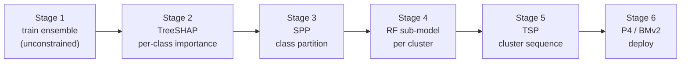

# dune-arena


> The version of [DUNE](https://github.com/nds-group/DUNE) (IEEE INFOCOM 2025) I used to produce
> the results in my undergraduate thesis (TCC), with a handful of tweaks to the pipeline I believe
> improve on the original — chiefly, making the Stage-1 model's choice actually reach the deployed
> switch.

**In-network machine learning** runs a traffic classifier *inside* a programmable switch, at line
rate. **DUNE** makes a model too big for one switch fit by splitting it into hardware-sized
sub-models spread across the switches a flow already crosses. This fork asks one question: *does
the choice of tree ensemble — Random Forest vs the boosting families — actually matter once it is
deployed?* Across ten seeds the short answer is **they tie statistically**. Getting a trustworthy
answer, though, meant fixing a spot where released DUNE silently discards the Stage-1 model's
feature preferences, so the choice never reached hardware. That fix, and the fair
[TreeSHAP](https://github.com/shap/shap) comparison it enables, are what this repo adds.

If you read the thesis and want to run it yourself, jump to [Quickstart](#quickstart-reproduce-a-run).

## Contents

- [How it works](#how-it-works)
- [What I changed vs DUNE](#what-i-changed-vs-dune)
- [Quickstart: reproduce a run](#quickstart-reproduce-a-run)
- [From scratch (raw TON-IoT)](#from-scratch-raw-ton-iot)
- [Stage 6: in-network deploy](#stage-6-in-network-deploy-lab-only)
- [Results](#results)
- [Repository layout](#repository-layout)
- [Caveats](#caveats)
- [Citing](#citing)

## How it works

DUNE's control pipeline runs six stages off-switch and ends in a P4 program per switch:



Stage 1 trains a large model free of hardware limits; Stage 2 scores how much each feature matters
per class; Stage 3 groups classes that share predictors into clusters; Stage 4 trains a
hardware-sized Random-Forest sub-model for each cluster; Stage 5 orders the clusters along the
flow's path; Stage 6 compiles each sub-model to P4. Only Stage 1's *analysis* picks the model — the
sub-models that run on the switch are always Random Forests. **Stages 2 and 4 are where this fork
diverges from DUNE.**

## What I changed vs DUNE

- **TreeSHAP instead of PCFI (Stage 2).** DUNE scores importance with PCFI, which is tied to one
  model family. TreeSHAP is model-agnostic, so four ensembles compete on equal footing as the
  Stage-1 model: Random Forest, XGBoost, LightGBM, CatBoost.
- **The propagation fix — the change I care about most.** Released DUNE's Stage 4 re-derives each
  cluster's features from a *fresh* Random Forest's Gini importance, discarding the Stage-2 scores.
  So the Stage-1 model reached hardware only through the class partition; its feature preferences
  barely propagated. Here, Stage 4 ranks each cluster's features by *that cluster's* TreeSHAP
  importance (restricted to the BMv2-deployable features), so the Stage-1 choice flows all the way
  to the deployed sub-models. See `cluster_analysis/src/model_analysis/modelAnalyzer.py`.
- **Smaller fixes I would keep:** per-class normalization of the TreeSHAP matrix (matches the
  contract DUNE's SPP gain threshold assumes); a flow-grouped train/validation split so no flow
  leaks across it; a brute-force TSP for Stage 5 that drops the Gurobi dependency; a BMv2 P4
  generator with generalized n-class majority voting; and one documented `prepare_dataset.py` in
  place of three data-prep scripts.

## Quickstart: reproduce a run

**Prerequisites:** Python ≥ 3.10 and [uv](https://docs.astral.sh/uv/). (Rebuilding features from raw
pcaps also needs `tshark`, but the prepared dataset below lets you skip that.)

```bash
git clone https://github.com/pedrosuffert/dune-arena && cd dune-arena
uv sync                                    # build the environment from uv.lock

# grab the prepared 7-class dataset (skips all raw-pcap processing)
mkdir -p data
curl -L https://github.com/pedrosuffert/dune-arena/releases/download/v0.1.0/dune-arena-toniot-dataset.tar.gz \
  | tar xz -C data

# run the offline pipeline and print the comparison table
uv run python treeshap/train_models.py     # Stage 1: train the 4 ensembles + TreeSHAP
uv run python treeshap/build_importance.py  # Stage 2: per-class TreeSHAP matrices
uv run python treeshap/run_spp.py           # Stage 3: SPP class partition
uv run python treeshap/stage45.py           # Stage 4 + 5: sub-models, then sequence
uv run python treeshap/collate.py           # -> data/output/results_comparison.csv
```

That reproduces **one seed**. The thesis reports mean ± std over ten; to repeat that, loop the seed
(the dataset is fixed — `DUNE_SEED` only reseeds the model training and the train/validation split):

```bash
for s in $(seq 1 10); do
  for stage in train_models build_importance run_spp stage45; do
    DUNE_SEED=$s uv run python treeshap/$stage.py
  done
done
```

## From scratch (raw TON-IoT)

To rebuild the dataset from the original captures instead of the Release:

1. Get the TON-IoT raw pcaps and the `GroundTruth_Network` CSVs (Alsaedi et al., 2020).
2. Point the pipeline at them: `export DUNE_FAIR_DATA=/path/to/data DUNE_FAIR_GT=/path/to/groundtruth`.
3. Extract flow features with DUNE's Stage 0 (`data_generation`, needs `tshark`).
4. Build the canonical 7-class dataset, then run the same Stage 1–5 commands as above:

```bash
uv run python treeshap/build_label_map.py   # Flow ID -> Label, from the GroundTruth CSVs
uv run python treeshap/prepare_dataset.py    # merge -> train_7class.csv + test pcap + Stage-4 inputs
```

Regenerated data is *equivalent*, not byte-identical, to the Release; the published conclusion is a
statistical tie, so that is enough.

## Stage 6: in-network deploy (lab only)

Stage 6 deploys the generated P4 on a real BMv2 fattree (Mininet) and scores it end to end. It needs
a lab box with `simple_switch_grpc`, Mininet, and `p4runtime_sh`, so it is **not pip-installable**.
See `testbed/` and `testbed/PROVENANCE.md`.

```bash
uv run python treeshap/train_submodels.py rf                        # sub-models for one model
uv run python treeshap/generate_p4.py --sav <F.sav> --out <X.p4> \
    --model-id <N> --offset <K> --classlist "<c1,c2,...>"           # emit the P4 program
```

## Results

Flow-weighted macro-F1 over the seven classes, mean ± standard deviation across ten seeds (real
BMv2 fattree in-network, 3258 test flows). Higher is better.

| Stage-1 model | offline macro-F1 | in-network macro-F1 |
|---------------|-----------------:|--------------------:|
| Random Forest | 89.67 ± 0.50 | 89.30 ± 0.93 |
| XGBoost       | 90.27 ± 0.92 | 89.74 ± 0.81 |
| LightGBM      | 90.22 ± 0.50 | 89.82 ± 0.67 |
| CatBoost      | 89.85 ± 0.85 | 89.54 ± 0.71 |

- **The four ensembles tie.** Every pairwise comparison is non-significant (Wilcoxon signed-rank,
  p = 0.23–1.0), offline and in-network. The single-seed rankings I first saw were noise.
- **The propagation fix still matters, structurally.** With it the four deploy *distinctly* — each
  ranks features by its own TreeSHAP and lands on different sub-model features, tree configurations,
  and cluster sequence. The fix buys that the Stage-1 choice reaches hardware at all; it does not
  buy a reliably more accurate model.
- **Partitions are seed-sensitive.** The RF = LightGBM = CatBoost three-way agreement shows up in
  only 3 of 10 seeds, and no pair shares a partition reliably. The one invariant: `ddos` and `dos`
  never land in the same cluster (0 of 40 model-seed cases). For volumetric DoS, the partition
  matters more than the algorithm.
- **In-network tracks offline** within +0.3 to +0.5 p.p. for every model, so the generated P4 is
  faithful. Random Forest keeps the least per-flow state (≈328 register collisions vs ≈900–1000 for
  the boosting models).

## Repository layout

```
dune-arena/
├── treeshap/                 # contribution layer: the pipeline glue
│   ├── paths.py              #   single path source; env DUNE_FAIR_DATA / DUNE_FAIR_GT override
│   ├── build_label_map.py    #   Flow ID -> Label map from TON-IoT GroundTruth CSVs
│   ├── prepare_dataset.py    #   one-time: merge raw TON-IoT -> train_7class.csv, test pcap, Stage-4 inputs
│   ├── train_models.py       #   Stage 1: train the 4 ensembles + TreeSHAP importance
│   ├── build_importance.py   #   Stage 2: normalized per-class TreeSHAP matrices
│   ├── run_spp.py            #   Stage 3: SPP class partition (4 clusters)
│   ├── stage45.py            #   drives Stage 4 (grid) + Stage 5 (TSP) for all models
│   ├── train_submodels.py    #   Stage 6a: train + save per-cluster RF sub-models
│   ├── generate_p4.py        #   Stage 6b: BMv2 P4 generator (n-class majority voting)
│   └── collate.py            #   one results view -> output/results_comparison.csv
├── cluster_analysis/         # DUNE Stage 4 (modelAnalyzer.py holds the propagation fix)
├── data_generation/          # DUNE Stage 0: pcap -> flow features (tshark)
├── model_partitioning/SPP/   # DUNE Stage 3: SPP solver
├── model_sequencing/         # DUNE Stage 5: TSP sequencing
├── unconstrained_model_analysis/   # DUNE PCFI — reference only, LEGACY-bannered (replaced by TreeSHAP)
├── testbed/                  # vendored BMv2/Mininet testbed, lab-only (see testbed/PROVENANCE.md)
├── pyproject.toml            # uv project
└── uv.lock
```

**What's ours vs vendored.** `treeshap/` and the `modelAnalyzer.py` fix are this fork's
contribution. Everything else under the stage directories is vendored from DUNE: the parts the
pipeline drives (Stage 0 `data_generation`, Stage 3 `model_partitioning/SPP`, Stage 4
`cluster_analysis/run_cluster_analysis.py` + `modelAnalyzer.py`, Stage 5 `model_sequencing`), plus
reference-only files kept but never run:

- `unconstrained_model_analysis/` — DUNE's PCFI Stage 1–2, replaced by TreeSHAP (`treeshap/build_importance.py`).
- `cluster_analysis/src/{f1_analysis_evaluation, run_correlation_experiment, run_simple_classifier}.py` — DUNE analysis/demo scripts.
- `model_partitioning/src/model_partitioning.py` — DUNE's Stage-3 runner, replaced by `treeshap/run_spp.py`.

Each reference-only file carries a `# === LEGACY (vendored from DUNE) ===` banner at its top.

## Caveats

- **TON-IoT port bias.** The dataset is testbed traffic; web-attack classes (xss, injection,
  password) concentrate on the victim's service ports, so port features inflate their separability
  beyond a production capture.
- **"Normal" is not a clean benign capture.** It is background traffic absent from the attack ground
  truth, recovered from the DoS captures, not an independent benign trace.
- **Deployable feature set.** Stage 4 restricts features to the 19 BMv2-deployable ones; no
  division-based features (e.g. Flow IAT Mean) reach the switch.
- **Statistical tie.** Results are mean ± std over ten seeds; the four models are statistically tied
  (pairwise Wilcoxon n.s.), so no single ensemble is reliably best.

## Citing

- **DUNE** — Bütün et al., *DUNE: Distributed Inference in the User Plane*, IEEE INFOCOM 2025.
  Source: https://github.com/nds-group/DUNE
- **TON-IoT** — Alsaedi et al., *TON_IoT Telemetry Dataset*, IEEE Access, 2020.

This fork accompanies my undergraduate thesis (TCC) in Computer Engineering at the University of
Brasília (UnB).
